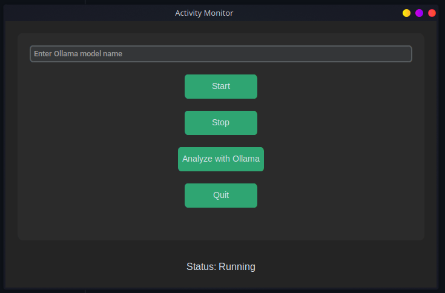
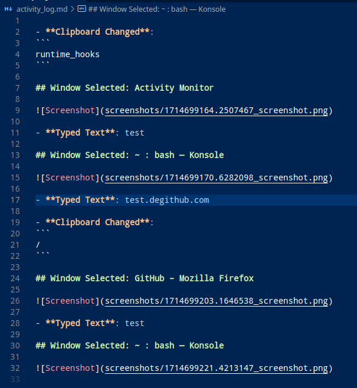

# Automated Documentation 📊
###### *with optional Ollama Integration*

**Automated Documentation** streamlines your digital workflow by meticulously logging your daily computer activities in a markdown document. From capturing website visits and clipboard changes to monitoring active windows and recording typed text, this tool enhances productivity and keeps detailed records for review. Perfect for professionals and personal use to keep track of digital interactions seamlessly.

---

## Screenshots
---



_Screenshot: the main program with built with customtkinter_



_Screenshot: output example without Ollama_

---

## Overview 🌟

Automated Documentation is a robust desktop application designed to log your daily computer activities comprehensively. From tracking visited websites to capturing text inputs, this tool ensures no significant details escape your notice. 🖥️📝

## Features 🛠️

- **Website Tracking**: Logs all URLs visited throughout the day.
- **Clipboard Monitoring**: Monitors and records every change made to the clipboard.
- **Active Window Monitoring**: Identifies which window is currently active and captures a screenshot each time it changes.
- **Text Monitoring**: Records all typed text until the completion marked by pressing `Enter`.
- **Screenshot Capturing**: Takes screenshots of active windows to provide a visual history.
- **Markdown Documentation**: Compiles all recorded activities into a readable Markdown file.

## Quick Start 🚀

### Prerequisites

Ensure you have Python installed along with the following packages:

```bash
pip install customtkinter keyboard clipboard pygetwindow pyscreenshot markdown2 ollama
```

### Installation

1. Clone the repository or download the source code:
   ```bash
   git clone https://github.com/tilltmk/automated-documentation.git
   ```
2. Navigate to the project directory:
   ```bash
   cd automated-documentation
   ```

### Running

Execute the main script to start Automated Documentation:

```bash
python ActivityMonitor.py
```

## Configuration 🔧

Automated Documentation comes ready to use with default settings, but you can adjust the configurations to better meet your specific needs.
Sudo / Root Access might be required on Linux.

### Installation of required packages on Linux

#### Debian/Ubuntu

```bash
sudo apt-get update
sudo apt-get install python3-pip python3-tk xdotool scrot
sudo pip3 install -r requirements.txt
```

#### Arch Linux

```bash
sudo pacman -Syu
sudo pacman -S python-pip tk xdotool scrot
sudo pip install -r requirements.txt
```

#### openSUSE

```bash
sudo zypper refresh
sudo zypper install python3-pip python3-tk xdotool scrot
sudo pip3 install -r requirements.txt
```

#### Fedora

```bash
sudo dnf update
sudo dnf install python3-pip python3-tk xdotool scrot
sudo pip3 install -r requirements.txt
```
#### Ollama Installation

Please refer to:
https://github.com/ollama/ollama

## Contributing 🤝

Just fork it.

## License 📜
OpenSource under the GNU AFFERO GENERAL PUBLIC LICENSE V3. Please refer to `LICENSE.md`.

